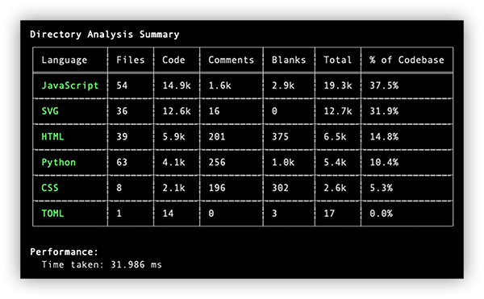
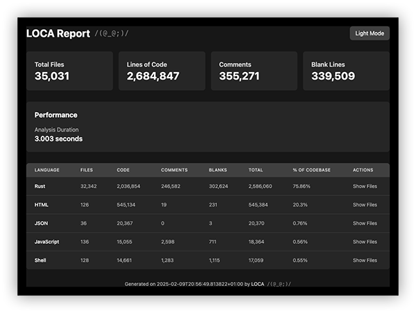

# LOCA /(@_@;)/

A _lines of code analyzer_ that generates stats and visualizations for your codebase in various formats.

## Features

- Analyze source code from files and directories
- Compare two directories to see differences
- Multiple output formats: CLI tables, JSON, CSV, and HTML reports
- Interactive HTML report with dark mode and sortable tables
- Exclude specific file extensions
- Set minimum line count thresholds
- Fast analysis with progress indication

## Installation

```bash
cargo install --git https://github.com/Gray0x5E/loca --force
```

## Usage

Basic directory analysis:
```bash
loca path/to/analyze
```

Compare two directories:
```bash
loca path1 path2
```

Common options:
```bash
# Show detailed breakdown including comments and blank lines
loca -d path/to/analyze

# Sort results by specific metric (code, files, comments)
loca -s files path/to/analyze

# Only show languages with at least 1000 lines
loca --min-lines 1000 path/to/analyze

# Exclude specific file extensions
loca -e js -e css path/to/analyze

# Generate HTML report
loca -f html -o report.html path/to/analyze

# Generate JSON output
loca -f json path/to/analyze
```

## Example outputs

### CLI table output


### HTML report


### JSON output
```json
{
  "timestamp": "2025-12-31T10:30:00+00:00",
  "path": "~/src/my_project",
  "duration": 3.021019917,
  "formatted_duration": "3.021 seconds",
  "total_files": 35031,
  "total_code": 2684847,
  "total_comments": 355271,
  "total_blanks": 339509,
  "languages": [
    {
      "name": "Rust",
      "files": [...],
      "file_count": 32342,
      "code": 2036854,
      "comments": 246582,
      "blanks": 302624,
      "total": 2586060,
      "percentage": 0.76
    }
  ]
}
```

## Options reference

```
USAGE:
    loca [FLAGS] [OPTIONS] [PATH] [COMPARE_PATH]

FLAGS:
    -d, --detailed    Show detailed breakdown including blank lines and comments
    -h, --help        Prints help information
    -V, --version     Prints version information

OPTIONS:
    -e, --exclude <exclude>...    File extensions to exclude
    -f, --format <format>         Output format (table, json, csv, html) [default: table]
        --min-lines <min_lines>   Minimum lines of code to include in results
    -o, --output <output>         Output file path
    -s, --sort-by <sort_by>       Sort results by (code, files, comments) [default: code]

ARGS:
    <path>           The path to analyze (defaults to current directory)
    <compare_path>   Optional second path for comparison
```

## Contributing

Issues and pull requests are welcome. For major changes, please open an issue first to discuss what you would like to change.

## License

MIT
